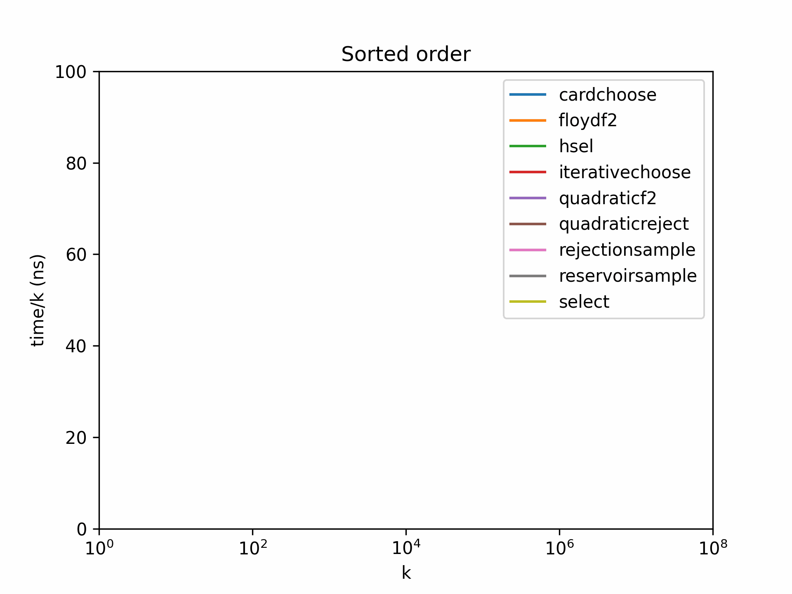
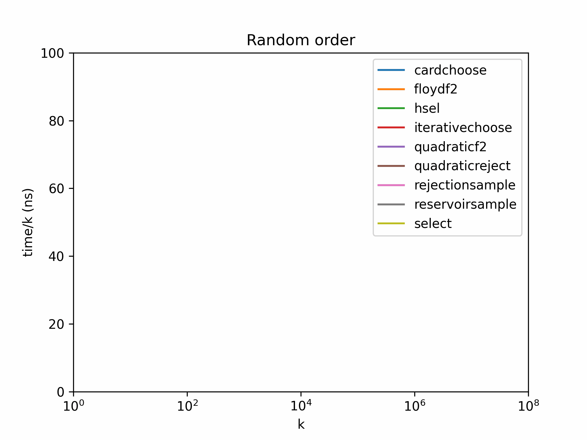

# C++ results

`cardchoose` outperforms `rejectionsample`, `floydf2`, and `hsel` for all
values of _n_ and _k_. `quadraticreject` and `quadraticf2` are good where _k_ < 100 or so, and
`select`, `iterativechoose`, and `reservoirsample`
perform well when _k_/_n_ is large.

This is hard to graph when both _n_ and _k_ affect the performance. For a fixed value of
_n_, we can graph the performance of each algorithm for various values of _k_; we graph time/_k_ to show the cost in ns per number we output. We then animate to show performance for varying values of _n_. Since we are plotting a linear/log graph of time/_k_, the
_k_ log _k_ performance of the algorithm is visible as a straight line.

[Full results](results/2022-12-22/)

