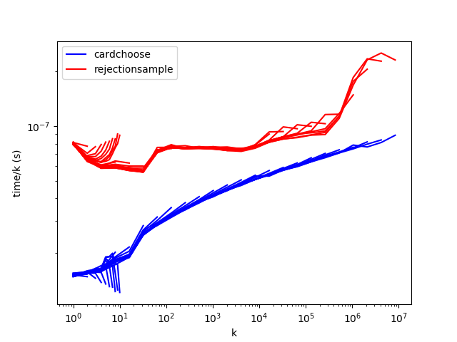
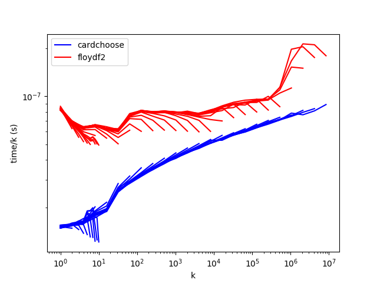
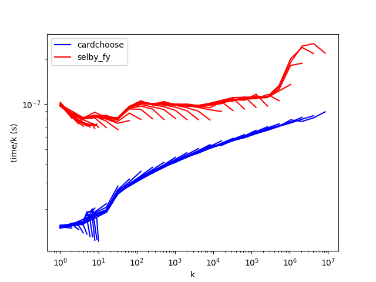
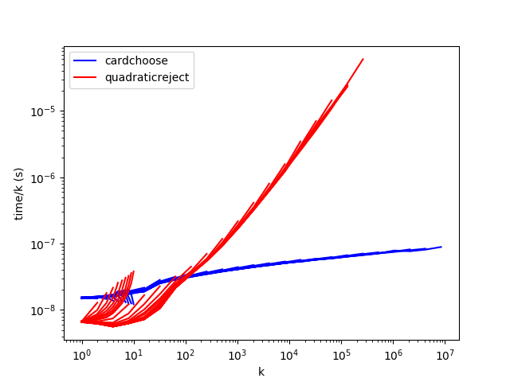
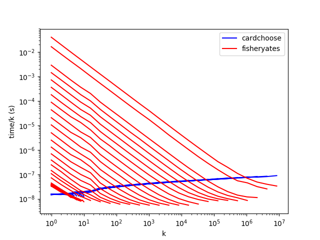
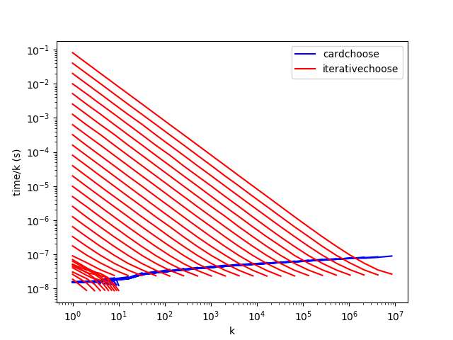

# C++ results

Both _k_ and _n_ can make a difference to performance, so it's not easy to find
a good way to graph the reults. I've settled for log-log graphs of time/_k_
against _k_. You can download the [raw
results](results/2018-10-20-cpp-random/csv.csv).

`cardchoose` outperforms `rejectionsample`, `floydf2`, and `selby_fy` for all
values of _n_ and _k_. `quadraticreject` is best where _k_ < 100 or so, and
`fisheryates` and `iterativechoose` perform well when _k_/_n_ is large.

