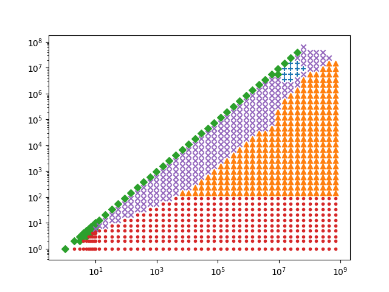
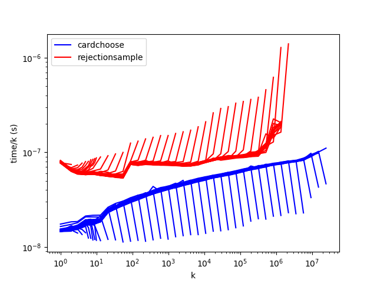
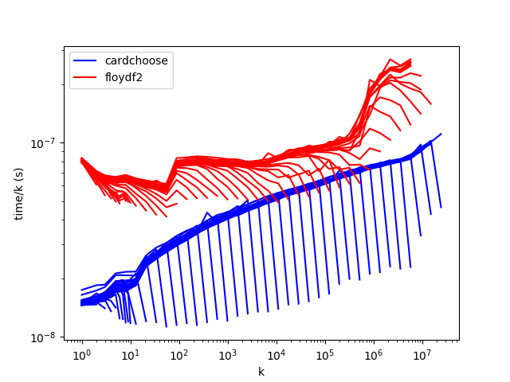
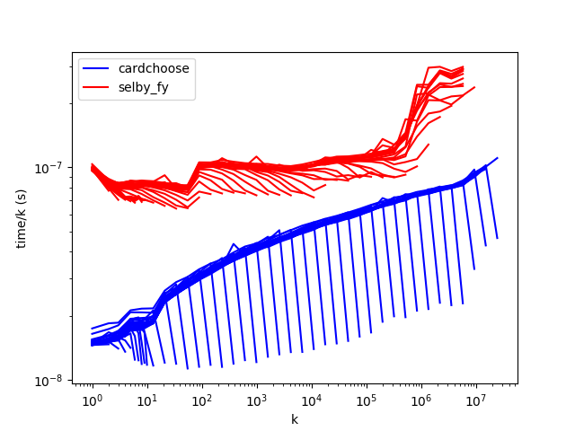
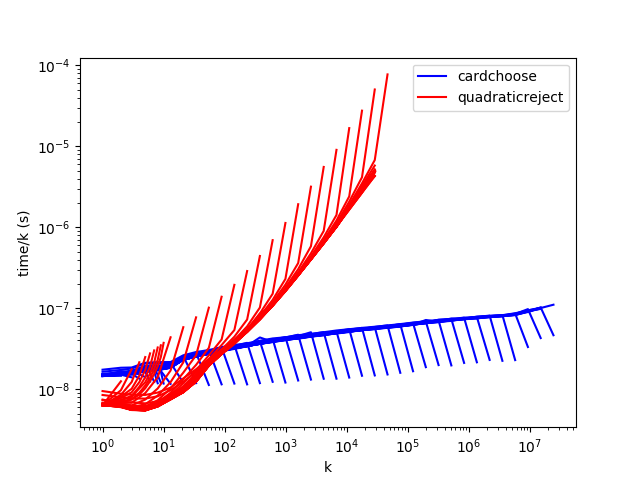
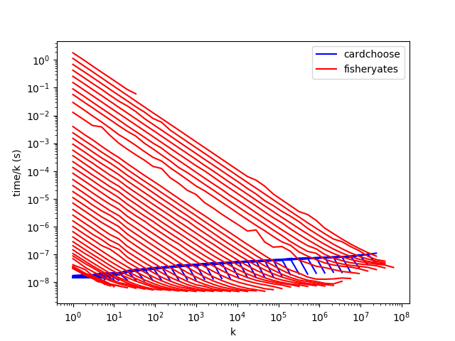
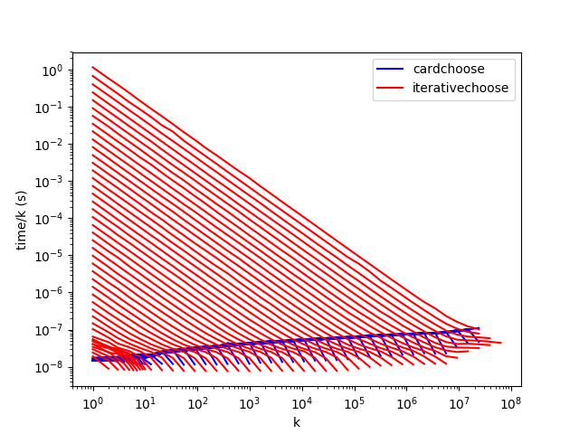
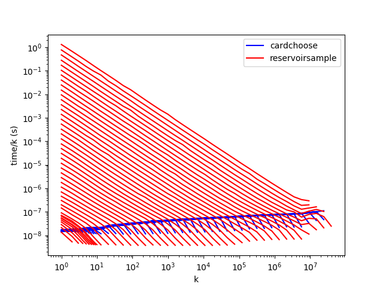

# C++ results

`cardchoose` outperforms `rejectionsample`, `floydf2`, and `selby_fy` for all
values of _n_ and _k_. `quadraticreject` is good where _k_ < 100 or so, and
`fisheryates` and `iterativechoose` perform well when _k_/_n_ is large. The below graph shows the best algorithm for various values of _n_ and _k_.

* reservoirsample: green diamond
* fisheryates: mauve X
* iterativechoose: cyan +
* quadraticreject: red dot
* cardchoose: orange triangle

Both _k_ and _n_ can make a difference to performance, so it's not easy to find
a good way to graph the results. I've settled for log-log graphs of time/_k_
against _k_. You can download the [raw
results](results/2018-10-23/cpp/random).

