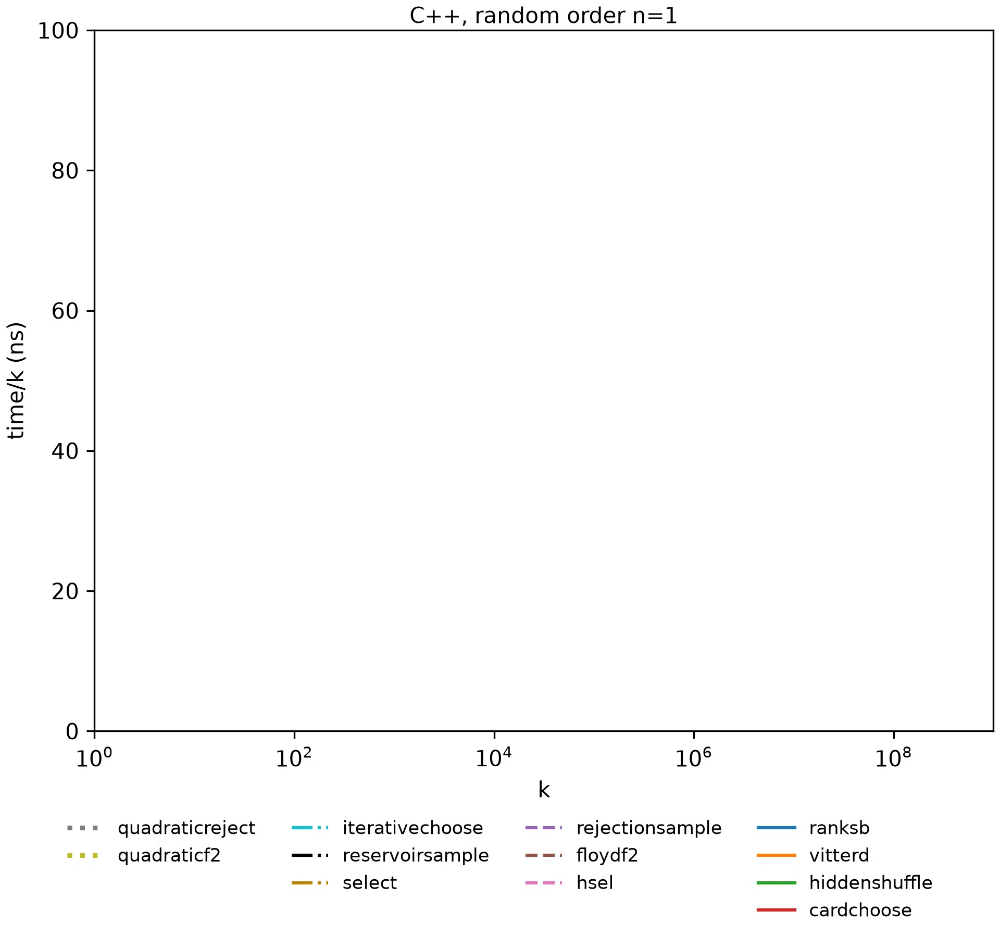
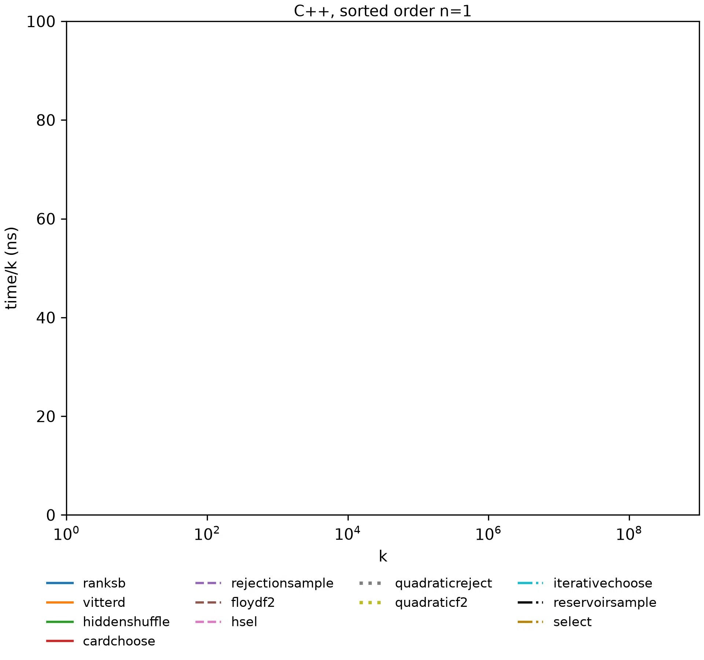
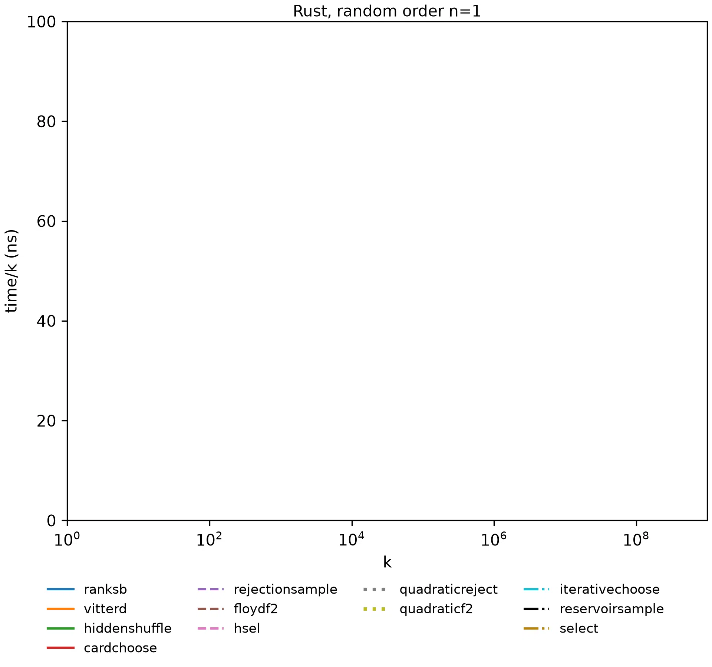

# Results

These results were measured on an AWS r8a.xlarge, whose four vCPUs are each a whole core of an AMD
EPYC 9R45, with 32GiB of memory, running NixOS 25.11, using clang 21.1 with libc++ and rustc 1.98,
for values of _n_ and _k_ that are Fibonacci numbers, with _k_ at most 102,334,155 (the 40th
Fibonacci number). [Full results](results/latest/)

Each algorithm is timed in a process of its own, and its CSVs record the commit and setup it was
timed with.

Since both _n_ and _k_ affect the performance, I compare algorithms using an animated graph. For
each frame, I fix the value of _n_ and graph the performance of each algorithm for various values
of _k_; I graph time/_k_ to show the cost in ns per number output. Since the graph of time/_k_ is
linear/log, the _k_ log _k_ performance of `cardchoose` is visible as a straight line.

## Choosing algorithms to cover every case

No single algorithm is close to the fastest everywhere, so a good implementation will implement
several and choose between them based on _n_ and _k_. [Choosing algorithms](choosing.md) gives the
best sets of one, two or three algorithms in each case, by two different measures, and the
trade-off between them.

## Each algorithm

The table gives, for each algorithm, its worst time as a multiple of the fastest of all the
algorithms, over the points with _k_ ≥ 10. I stop timing an algorithm at larger values of _k_ for
the same _n_ once a single call takes more than 30 seconds, and at that _k_ and all larger ones for
every later _n_ once that has happened at the same _k_ for two values of _n_. Where that happened,
its worst case is unknown, so it is shown as ?, with the smallest _k_ it was not timed at. I give
worst cases rather than averages because any average depends on which values of _n_ and _k_ I chose
to test. Generated by `python/summarise results/latest --markdown --group` followed by all
twelve algorithms.

| | C++, random order | C++, sorted order | Rust, random order | Rust, sorted order |
|---|---|---|---|---|
| `quadraticreject` | ? not timed from k=1.3×106 | ? not timed from k=1.3×106 | ? not timed from k=1.3×106 | ? not timed from k=1.3×106 |
| `rejectionsample` | 707× | 1,973× | 246× | 4,080× |
| `ranksb` | 74.3× | 471× | 45.0× | 901× |
| `floydf2` | 106× | 285× | 44.0× | 489× |
| `quadraticf2` | ? not timed from k=1.3×106 | ? not timed from k=1.3×106 | ? not timed from k=1.3×106 | ? not timed from k=1.3×106 |
| `iterativechoose` | 3.1×107× | 1.0×107× | 2.3×107× | 8.7×106× |
| `reservoirsample` | 2.8×107× | 9.8×106× | 2.9×107× | 1.4×107× |
| `vitterd` | 22.4× | 4.11× | 19.4× | 5.25× |
| `hiddenshuffle` | 24.1× | 3.92× | 18.6× | 7.67× |
| `select` | 1.1×107× | 3.7×106× | 7.9×106× | 3.6×106× |
| `hsel` | 30.4× | 63.2× | 22.1× | 61.8× |
| `cardchoose` | 21.0× | 16.8× | 9.78× | 29.2× |

The quadratic algorithms are the fastest for small _k_, and `select`, `iterativechoose` and
`reservoirsample` for small _n_/_k_, but each is very slow elsewhere. The rest run in O(_k_) or
O(_k_ log _k_) time and differ by smaller factors; their worst cases are where _k_/_n_ is large, where
the O(_n_) algorithms win.

A ratio overstates differences where both times are small. The next table gives, for each
algorithm, the most its time/_k_ exceeds that of the fastest of all the algorithms, per number
output, over the same points, with ? as before. Generated by `python/summarise results/latest
--markdown-excess --group` followed by all twelve algorithms.

| | C++, random order | C++, sorted order | Rust, random order | Rust, sorted order |
|---|---|---|---|---|
| `quadraticreject` | ? not timed from k=1.3×106 | ? not timed from k=1.3×106 | ? not timed from k=1.3×106 | ? not timed from k=1.3×106 |
| `rejectionsample` | 1.11µs | 1.19µs | 2.09µs | 1.97µs |
| `ranksb` | 354ns | 310ns | 363ns | 341ns |
| `floydf2` | 195ns | 227ns | 299ns | 192ns |
| `quadraticf2` | ? not timed from k=1.3×106 | ? not timed from k=1.3×106 | ? not timed from k=1.3×106 | ? not timed from k=1.3×106 |
| `iterativechoose` | 101ms | 96.5ms | 102ms | 83.6ms |
| `reservoirsample` | 90.0ms | 92.7ms | 128ms | 134ms |
| `vitterd` | 25.5ns | 15.5ns | 29.0ns | 19.5ns |
| `hiddenshuffle` | 25.4ns | 17.7ns | 25.1ns | 18.6ns |
| `select` | 36.5ms | 34.9ms | 35.4ms | 34.1ms |
| `hsel` | 219ns | 242ns | 74.9ns | 92.2ns |
| `cardchoose` | 32.1ns | 28.2ns | 25.5ns | 18.2ns |

By this measure three algorithms are never far from the fastest: `cardchoose`, `hiddenshuffle` and
`vitterd` are never more than 33 ns per number slower in any case, while every other algorithm is at
least 240 ns slower at some point where it was timed, and all but `hsel` over 290 ns. `cardchoose` is
the simplest of the three: it is a few lines of integer arithmetic, while the other two need
floating point and are considerably more involved. `vitterd` switches to Algorithm A once _n_ ≤ 13
_k_, and `hiddenshuffle` runs three stages in turn, the last of them Algorithm A. `cardchoose`'s
worst point in every case is at one of the two largest _k_, with _n_ the next Fibonacci number above
it, where the O(_n_) algorithms are fastest; at _k_ = _n_ itself it has almost nothing to do. Along
those points its excess grows slowly with _k_, as the log _k_ factor of its sort would suggest,
until _k_ is several million; beyond that, the output array no longer fits in the 16MiB L3 cache,
and the excess grows faster.

The region claims below come from [`python/regions`](python/regions), which gives the range of
one algorithm's time over another's, or over the fastest of all the others, in bands of _n_/_k_
and _k_.

## Each pair of algorithms

For every pair of algorithms, the pairwise comparisons give how much slower one is than the other
at its worst, and where, both as a [ratio of times](results/latest/pairwise-ratio.md) and as a
[difference in time/_k_](results/latest/pairwise-difference.md).

## C++

The C++ implementations use only the standard library, here libc++: `std::unordered_set` and
`std::unordered_map`, which are node-based, and `std::sort`. So these results show the
performance you get from standard components.

For sorted output, `hiddenshuffle` is the fastest algorithm wherever _n_ ≥ 16 _k_ and _k_ ≥ 1000.
There, `cardchoose` takes up to 2.4× as long, and `ranksb` 1.14–2.7× as long. `ranksb` slows down as
_k_ approaches _n_, where Nijenhuis and Wilf pair it with `iterativechoose` (which they refer to as
RKS2). For random output, `select` is the fastest wherever 2 _k_ ≤ _n_ < 16 _k_ and _n_ is under 8
million; for larger _n_, where each call maps its array afresh (see [SELECT](algorithms.md#select)),
it takes up to 1.8× as long as the fastest there. With _k_ ≥ 1000, `hiddenshuffle` followed by a
shuffle is the fastest where _n_ ≥ 256 _k_. `cardchoose` is faster than `rejectionsample`, `floydf2`
and `hsel` at every point where _k_ ≤ _n_/2: they take 1.12–8.3× as long, and at least 1.15× as
long where _n_ ≥ 4 _k_.

## Rust

The Rust implementations use Rust's standard `HashMap`, `HashSet` and unstable sort. The hash
tables are flat open-addressing tables, much faster than the node-based C++ ones; the hash-based
algorithms take about 0.3× as long in Rust as in C++, and `cardchoose` about 0.5–0.6×, while
`ranksb`, `vitterd` and `hiddenshuffle` take about the same time in both for sorted output, and
about 10% longer in Rust for random output.

For sorted output, `cardchoose` and `hiddenshuffle` divide the range by _k_. Wherever _k_ < 1000 and
_n_ ≥ 2 _k_, `cardchoose` is the fastest algorithm or within 22% of it, and `hiddenshuffle` takes up
to 3.7× as long as `cardchoose`. For larger _k_ they trade places: wherever _k_ ≥ 105 and
_n_ ≥ 16 _k_, each is within 26% of the fastest algorithm, and `hiddenshuffle` is the fastest
wherever _k_ ≥ 107 and _n_ ≥ 16 _k_. For random output, as in C++, `select` is the
fastest wherever 2 _k_ ≤ _n_ < 16 _k_ and _n_ is under 8 million, and `hsel` is within 16% of the
fastest wherever _n_ ≥ 256 _k_ and 1000 ≤ _k_ < 105. `cardchoose` is never more than
1.57× slower than the fastest of `rejectionsample`, `floydf2`, `hsel` and itself where _k_ ≤ _n_/2.

